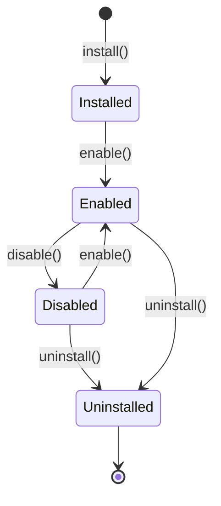

# 插件生命周期

## 生命周期流程

## 生命周期方法

### install()

插件安装时调用，通常执行以下操作：

- 执行数据库迁移
- 创建插件所需的数据表
- 注册插件菜单和权限

### enable()

启用插件时调用：

- 激活插件的路由
- 注册事件监听器
- 加载插件配置

### disable()

禁用插件时调用：

- 停用插件路由
- 移除事件监听器

### uninstall()

卸载插件时调用：

- 回滚数据库迁移
- 删除插件相关的数据
- 清理菜单和权限
